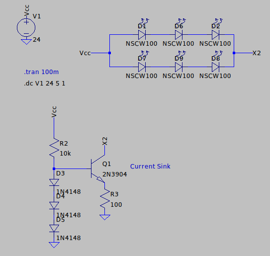
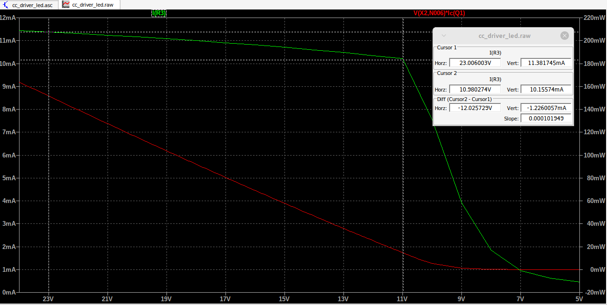
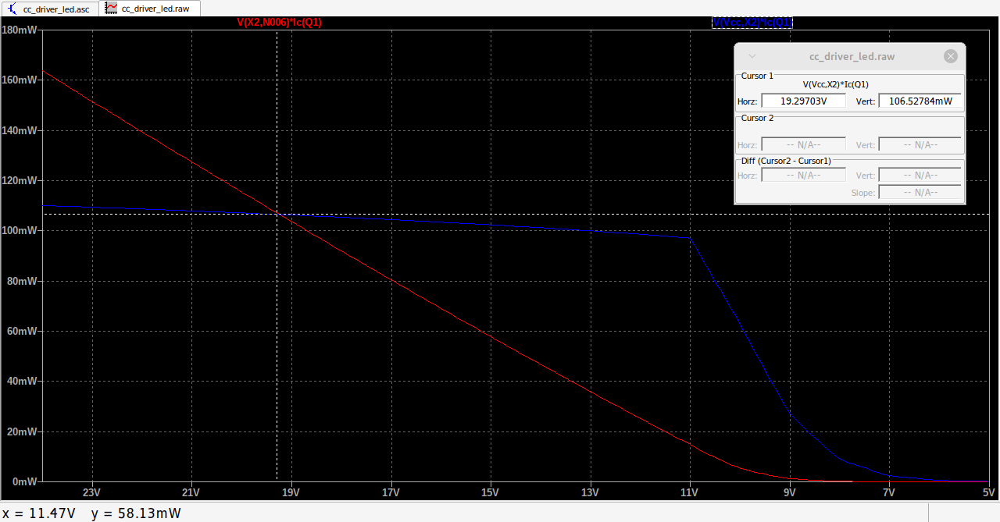
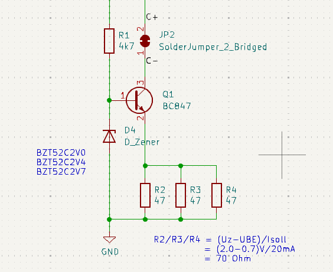
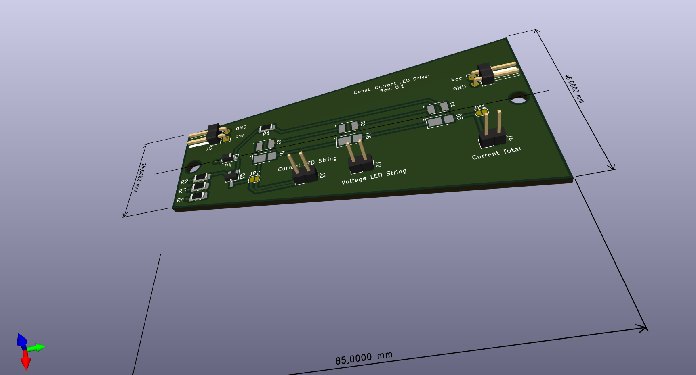
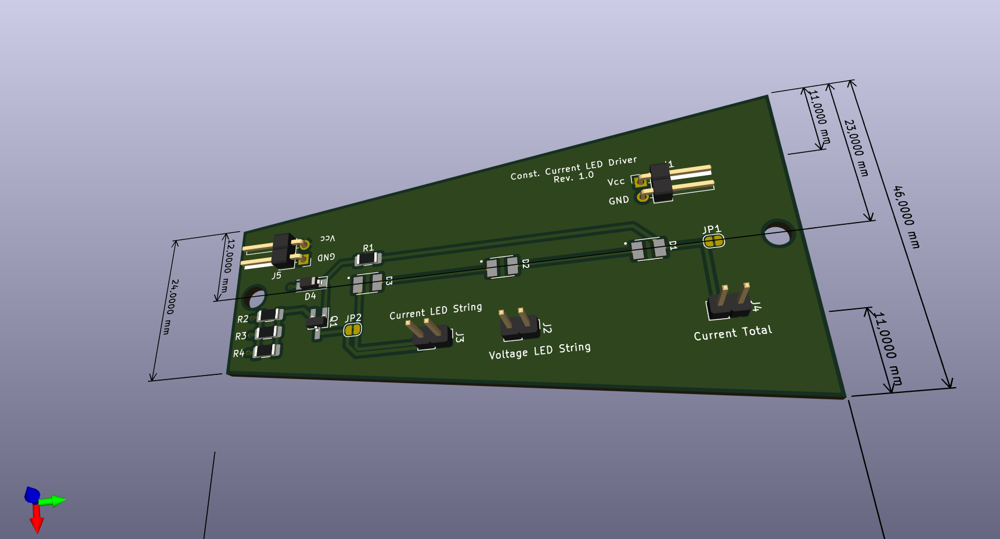

# Fettuccine-Alfredo
very basic and cheap constant current circuit for medium power LED's

This project is about to design a very simple LED driver circuit for medium power LED's. I'd like to play around with different LED color temperatures and shapes. 

# Simulations and Schematics





# Adjusting Current
```math
I_{LED} \approx I_{R_S} = \frac{U_{D} - U_{BE}}{R_S}  
```

```math
I_{LED} = \frac{1.8 V - 0.7 V}{100 \Omega} = 11mA  
```

## Revision 0 uses PLCC 2835 LED Footprint and 3528 (alternative)


## Revision 1 uses 3528 Footprint only


# Real World Examples
## Lamp
I used the [timer clock project](https://github.com/LMWB/Cannelloni-al-Forno) and three of this LED boards to create a illumination of my courtyard.  
  
  
  

## Star


# Sources
## Material
high performance power LED found on ebay  

