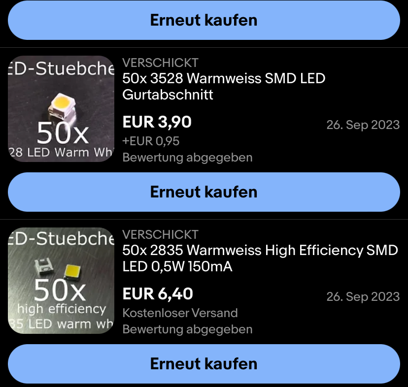
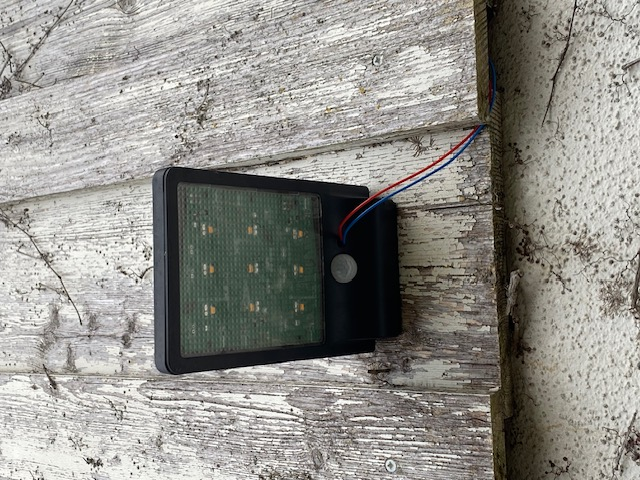
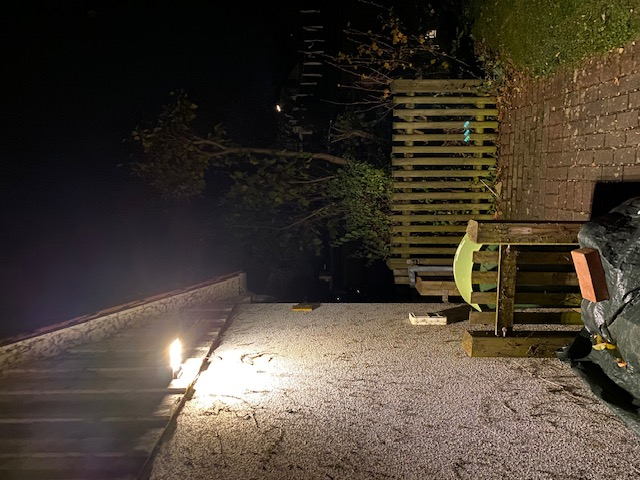
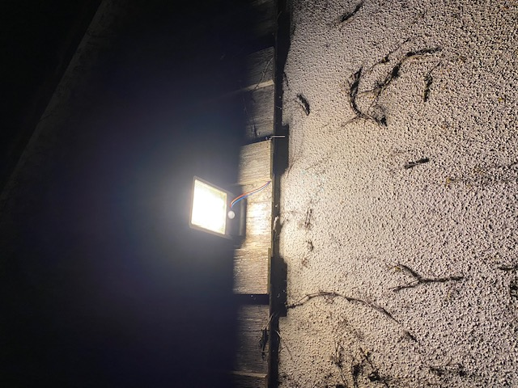

# LED_CC_Driver
very basic and cheap constant current circuit for medium power LED's

This project is about to design a very simple LED driver circuit for medium power LED's. I'd like to play araound with diverent LED color tempeatures and shapes. 

- Revision 0 uses PLCC 2835 LED Footprint and 3528 (alternative)
- Revision 1 uses 3528 Footprint only

# Real World Examples
I used the [timer clock project](https://github.com/LMWB/Cannelloni-al-Forno) and three of this LED borads to create a ilumination of my courtyard.  
  
  
  

# todo
- add spice results to readme
- add equation for R-shunt to readme
- add images of application in real world and test results
